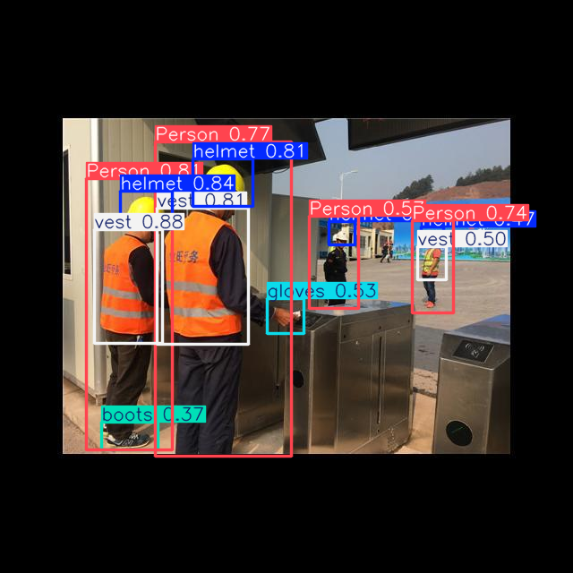
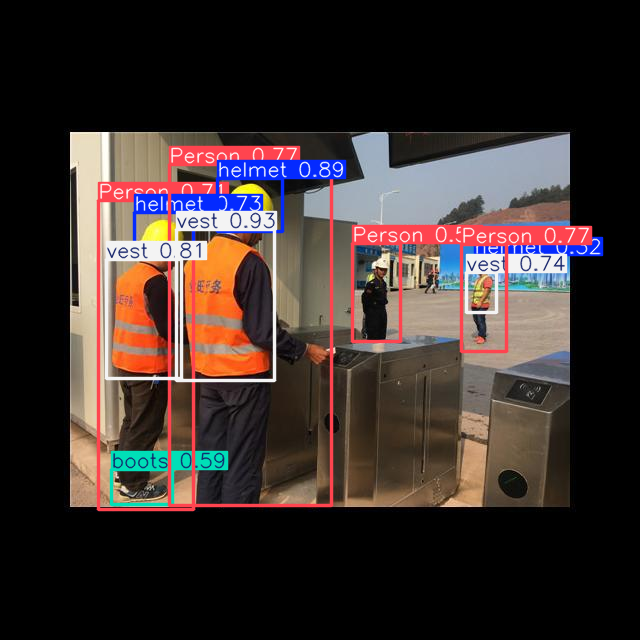

# PPE Detection with YOLO — Construction Site Safety Compliance

Fine-tuned two YOLO architectures (YOLO11n and YOLO26n) on the [Ultralytics Construction-PPE dataset](https://docs.ultralytics.com/datasets/detect/construction-ppe/) to detect personal protective equipment on construction sites — helmets, vests, boots, gloves, goggles — and flag when a worker is missing a required item.

Beyond training a detector, this project compares two model versions head-to-head on the same data and digs into *why* the model performs unevenly across classes, rather than just reporting a single accuracy number.

## Results

| Model | mAP50 | mAP50-95 |
|---|---|---|
| **YOLO11n** | **0.605** | **0.295** |
| YOLO26n | 0.515 | 0.265 |

YOLO11n outperformed YOLO26n on this dataset by a meaningful margin. This isn't a universal result — YOLO26 is a newer, edge-optimized architecture (NMS-free inference, DFL replaced with a lighter L1-loss-based box regression) that generally trades a small amount of accuracy for faster CPU inference and simpler deployment. On this particular dataset (1,132 training images, 11 classes), the older YOLO11 architecture generalized better. This matches independent reports from other users fine-tuning both models on their own custom datasets, suggesting newer isn't automatically better for small, specialized datasets.

## Per-class performance (YOLO11n, final)

| Class | Instances | Precision | Recall | mAP50 |
|---|---|---|---|---|
| Person | 239 | 0.807 | 0.895 | 0.899 |
| helmet | 201 | 0.816 | 0.837 | 0.834 |
| vest | 171 | 0.761 | 0.807 | 0.833 |
| boots | 151 | 0.663 | 0.788 | 0.820 |
| gloves | 136 | 0.814 | 0.765 | 0.789 |
| goggles | 47 | 0.742 | 0.723 | 0.748 |
| none | 81 | 0.636 | 0.605 | 0.590 |
| no_helmet | 45 | 0.682 | 0.467 | 0.547 |
| no_gloves | 56 | 0.546 | 0.151 | 0.272 |
| no_goggle | 41 | 1.000 | 0.044 | 0.243 |
| no_boots | 4 | 1.000 | 0.000 | 0.076 |

## Key finding: the model detects worn PPE well, missing PPE poorly

Every "presence" class (helmet, vest, boots, gloves, goggles, Person) scores in the 0.75–0.9 mAP50 range. Every "absence" class (no_helmet, no_goggle, no_gloves, no_boots) scores far lower — 0.08 to 0.55.

Two compounding causes:

1. **Severe class imbalance.** Missing-gear classes are rare in the dataset — `no_boots` has only 4 validation instances (and a similarly small count in training) versus 201 for `helmet`. With so few examples, the model has little signal to learn from, and small evaluation samples are noisy: `no_boots`' recall of 0 reflects missing all 4 real cases, not a reliable measure of the model's true ability on that class.
2. **Detecting absence is a harder task than detecting presence, independent of data volume.** `goggles` (47 instances, a presence class) scores 0.748 — noticeably better than `no_gloves` (56 instances, an absence class) at 0.272, despite having fewer training examples. Finding a distinct object in an image is a more direct visual task than inferring that an expected object is *not* there.

Both patterns held consistently across **both** YOLO11n and YOLO26n, which rules out architecture choice as the cause and confirms this is a dataset limitation, not a model failure.

## Sample predictions

**YOLO11n:**

**YOLO26n (same image):**

Both models correctly localize and classify helmets, vests, and boots on multiple workers in a single image. Note YOLO11n additionally caught a "gloves" detection that YOLO26n missed on this frame — a small, concrete illustration of the accuracy gap reflected in the overall mAP50 scores above.

## Training details

- **Dataset**: [Ultralytics Construction-PPE](https://docs.ultralytics.com/datasets/detect/construction-ppe/) — 11 classes (helmet, gloves, vest, boots, goggles, none, Person, no_helmet, no_goggle, no_gloves, no_boots)
- **Models**: `yolo11n.pt` and `yolo26n.pt`, both COCO-pretrained, fine-tuned via `ultralytics`
- **Epochs**: 50
- **Image size**: 640×640
- **Batch size**: 16
- **Optimizer**: auto-selected by `ultralytics` (AdamW)
- **Hardware**: Google Colab, Tesla T4
- **Training time**: ~17–20 minutes per model

Both models showed healthy, converging training curves — box_loss, classification loss, and box-regression loss (DFL for YOLO11n, L1 loss for YOLO26n) all decreased steadily over the 50 epochs, e.g. YOLO11n's box_loss dropped from 1.816 to 1.314.

## What I'd try next

- Add more training images for the missing-gear classes specifically, or apply class-weighted loss to force the model to pay more attention to rare classes
- Targeted augmentation for `no_boots` and `no_goggle`, the two weakest classes
- Try a small/medium YOLO variant instead of nano for more capacity
- Tune the confidence threshold for deployment — a safety-monitoring use case likely wants to prioritize recall (catch every possible violation) over precision (tolerate some false alarms)
